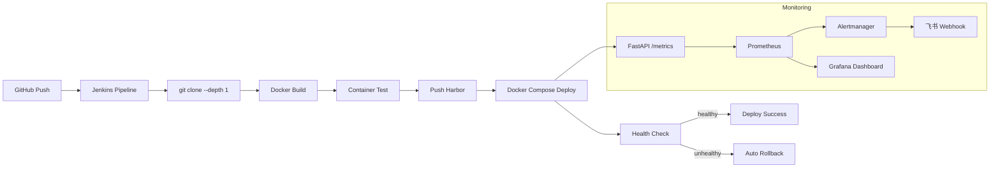
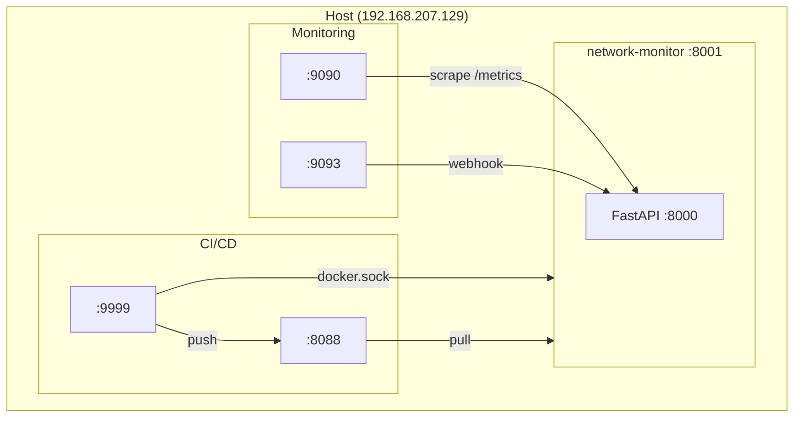

# Network Monitor

基于 FastAPI + Prometheus + Grafana + Jenkins + Harbor 的轻量级智能监控与自动化 CI/CD 平台。

## 项目简介

Network Monitor 是一个面向 DevOps 实践的全栈监控平台，集成了**系统指标采集**、**异常检测**、**告警通知**与**自动化持续交付**能力。项目解决了以下核心问题：

- **服务不可观测** — 通过 Prometheus + Grafana 实现系统指标实时采集与可视化
- **手动部署低效** — 通过 Jenkins Pipeline 实现 Git Push 到生产部署的全自动化
- **缺乏异常检测** — 内置 Z-Score 与阈值双重异常检测引擎，自动识别指标异常
- **无法持续交付** — 完整 CI/CD 链路：构建 → 测试 → 推送镜像 → 部署 → 健康验证 → 自动回滚

---

## 技术栈

### Backend

| 技术 | 版本 | 用途 |
|------|------|------|
| FastAPI | 0.110.0 | Web 框架与 API 服务 |
| Uvicorn | 0.29.0 | ASGI 服务器 |
| Python | 3.12 | 运行时 |
| psutil | - | 系统指标采集（CPU / 内存 / 磁盘 / 网络） |
| NumPy | 2.4.3 | Z-Score 异常检测计算 |
| SQLAlchemy | - | ORM，SQLite 持久化存储 |
| prometheus-client | - | Prometheus 指标暴露 |
| httpx | - | 异步 HTTP 客户端（飞书 Webhook） |

### DevOps

| 技术 | 用途 |
|------|------|
| Docker | 应用容器化 |
| Docker Compose | 多服务编排 |
| Jenkins (LTS) | CI/CD Pipeline 自动化 |
| Harbor (v2.11.1) | 私有 Docker 镜像仓库 |

### Monitoring

| 技术 | 用途 |
|------|------|
| Prometheus | 指标采集与存储 |
| Alertmanager | 告警规则与路由 |
| Grafana | 数据可视化仪表板 |

---

## 系统架构





---

## 项目目录结构

```
network-monitor/
├── app/
│   ├── __init__.py
│   ├── main.py                    # FastAPI 应用入口，lifespan 管理
│   ├── metrics.py
│   ├── api/
│   │   ├── __init__.py
│   │   └── routes.py              # API 路由（/health, /metrics, /alerts 等）
│   ├── collectors/
│   │   ├── __init__.py
│   │   ├── system.py              # 真实系统指标采集（psutil）
│   │   └── simulated.py           # 模拟指标生成（NumPy 随机）
│   ├── core/
│   │   └── metrics.py             # Prometheus Counter 定义
│   ├── detectors/
│   │   ├── __init__.py
│   │   ├── detector.py            # 检测器抽象基类
│   │   ├── zscore.py              # Z-Score 异常检测（滑动窗口）
│   │   └── threshold.py           # 阈值检测
│   ├── models/
│   │   ├── __init__.py
│   │   ├── metric.py              # 指标数据模型
│   │   ├── anomaly.py             # 异常数据模型
│   │   └── event.py               # 告警事件模型
│   ├── services/
│   │   ├── __init__.py
│   │   ├── simulation.py          # 后台指标采集与异常检测服务
│   │   └── alerting.py            # 告警管理（限流、去重）
│   └── storage/
│       ├── __init__.py
│       ├── database.py            # SQLAlchemy ORM 模型与引擎
│       ├── memory.py              # 内存存储
│       └── repository.py          # Repository 抽象层（SQLite / InMemory）
├── Dockerfile                     # 应用镜像构建
├── Jenkinsfile                    # CI/CD Pipeline 定义（参考用）
├── docker-compose.yml             # 本地开发编排
├── docker-compose.deploy.yml      # 生产部署编排（Harbor 镜像）
├── prometheus.yml                 # Prometheus 采集配置
├── alert.rules.yml                # Prometheus 告警规则
├── alertmanager.yml               # Alertmanager 路由配置
├── daemon.json                    # Docker daemon insecure-registry 参考
├── requirements.txt               # Python 依赖
└── README.md
```

---

## 功能特性

### 指标采集与监控

- **系统指标采集** — 通过 psutil 采集 CPU、内存、磁盘、网络吞吐量
- **模拟指标生成** — NumPy 随机模拟，用于开发与演示
- **Prometheus 集成** — `/metrics` 端点暴露 `request_count_total` 等指标
- **Grafana 可视化** — 对接 Prometheus 数据源，仪表板展示

### 异常检测

- **Z-Score 检测** — 滑动窗口 (50 样本) 统计异常，阈值 3.0
- **阈值检测** — 固定阈值 (80%) 超限告警
- **多检测器链** — 按指标名称配置不同检测器组合（CPU 使用 zscore + threshold，内存使用 zscore）

### 告警通知

- **Alertmanager 集成** — Prometheus 告警规则 → Alertmanager 路由
- **飞书 Webhook** — 告警事件自动推送至飞书群
- **告警限流** — 每指标每 5 分钟窗口去重，每分钟最多 2 条

### CI/CD 自动化

- **Jenkins Pipeline** — 5 阶段全自动流水线
- **Harbor 私有仓库** — 镜像版本管理与分发
- **健康检查** — Test 阶段 retry loop + Deploy 阶段 `docker inspect`
- **自动回滚** — 部署失败自动回退到上一版本

### 数据持久化

- **SQLite** — 通过 SQLAlchemy ORM 持久化指标、异常、事件
- **Repository 模式** — 支持 SQLite 与 InMemory 两种后端切换

---

## CI/CD 流程

Jenkins Pipeline 采用 **inline script** 模式（非 SCM Jenkinsfile），完全绕过 Git Plugin 的 SCM checkout 阶段。

### Pipeline 5 个阶段

```
Checkout → Build → Test → Push Harbor → Deploy
```

#### 1. Checkout

```groovy
sh 'git clone --depth 1 --branch main git@github.com:frey547/network-monitor.git .'
```

- `skipDefaultCheckout(true)` 禁用 Jenkins 默认 SCM checkout
- `--depth 1` 浅克隆，减少网络传输量
- 使用容器内 SSH key 直接认证 GitHub

#### 2. Build

```groovy
sh "docker build -t ${IMAGE_NAME}:${BUILD_NUMBER} -t ${IMAGE_NAME}:latest ."
```

- 双 tag：`BUILD_NUMBER` 用于版本追踪，`latest` 用于部署拉取
- 通过 docker.sock 在宿主机 Docker daemon 上构建

#### 3. Test

```groovy
sh "docker run -d --name test-network-monitor ${IMAGE_NAME}:${BUILD_NUMBER}"
sh '''
    for i in $(seq 1 30); do
        docker exec test-network-monitor curl -sf http://127.0.0.1:8000/health && exit 0
        sleep 2
    done
    exit 1
'''
```

- 启动临时容器运行新镜像
- 最多重试 30 次（共 60 秒），每 2 秒检查 `/health`
- 测试完成后无论成败自动清理容器

#### 4. Push Harbor

```groovy
withCredentials([usernamePassword(credentialsId: 'harbor', ...)]) {
    sh 'echo $HARBOR_PASS | docker login $HARBOR_URL -u $HARBOR_USER --password-stdin'
}
sh "docker push ${IMAGE_NAME}:${BUILD_NUMBER}"
sh "docker push ${IMAGE_NAME}:latest"
```

- Jenkins Credentials 管理 Harbor 账号
- 推送 `BUILD_NUMBER` tag 和 `latest` tag

#### 5. Deploy

```groovy
sh """
    cd ${DEPLOY_DIR}
    docker compose -f ${COMPOSE_FILE} pull network-monitor
    docker compose -f ${COMPOSE_FILE} up -d network-monitor
"""
// 等待 20 秒后检查容器健康状态
def health = sh(
    script: "docker inspect --format='{{.State.Health.Status}}' network-monitor",
    returnStdout: true
).trim()
```

- 从 Harbor 拉取最新镜像并滚动更新
- 通过 `docker inspect` 检查容器 HEALTHCHECK 状态（避免容器内 localhost 不可达问题）
- **自动回滚**：部署失败时自动 tag 回上一版本并重新部署

---

## Harbor 配置

### 基本信息

| 项目 | 值 |
|------|-----|
| 地址 | `192.168.207.129:8088` |
| 协议 | HTTP（非 HTTPS） |
| 镜像命名 | `192.168.207.129:8088/network-monitor/app` |

### Docker daemon 配置

在所有需要访问 Harbor 的节点配置 `/etc/docker/daemon.json`：

```json
{
  "insecure-registries": [
    "192.168.207.129:8088"
  ]
}
```

修改后重启 Docker：

```bash
sudo systemctl restart docker
```

### 使用示例

```bash
# 登录
docker login 192.168.207.129:8088 -u <username>

# 推送
docker tag myapp:latest 192.168.207.129:8088/network-monitor/app:latest
docker push 192.168.207.129:8088/network-monitor/app:latest

# 拉取
docker pull 192.168.207.129:8088/network-monitor/app:latest
```

---

## Jenkins 配置

### Docker 化部署

Jenkins 以容器方式运行，通过挂载 `docker.sock` 操作宿主机 Docker daemon：

```yaml
# /home/s/infra/jenkins/docker-compose.yml
services:
  jenkins:
    build:
      context: .
      args:
        DOCKER_GID: 984    # 匹配宿主机 docker 组 GID
    ports:
      - "9999:8080"        # Web UI
      - "50000:50000"      # Agent 通信
    volumes:
      - jenkins_data:/var/jenkins_home
      - /var/run/docker.sock:/var/run/docker.sock:ro
      - /home/s/network-monitor:/workspace/network-monitor
```

### 关键设计

| 设计点 | 说明 |
|--------|------|
| Docker CLI | Jenkins 镜像内安装 `docker-ce-cli` 和 `docker-compose-plugin` |
| Socket 权限 | 通过 `DOCKER_GID=984` 匹配宿主机 docker 组 |
| Volume 挂载 | 项目目录挂载到 `/workspace/network-monitor`，供 Deploy 阶段使用 |
| Pipeline 模式 | Inline Script（非 Pipeline script from SCM），避免 Git Plugin fetch 超时 |
| 插件预装 | 通过 `plugins.txt` + `jenkins-plugin-cli` 在构建镜像时安装 22 个插件 |

### 预装插件列表

Pipeline Core / Docker / Git & GitHub / Credentials / Build Tools / UI / Notifications / Monitoring

详见 `/home/s/infra/jenkins/plugins.txt`

---

## FastAPI 接口

| 方法 | 路径 | 说明 |
|------|------|------|
| `GET` | `/health` | 健康检查，返回 `{"status": "ok"}` |
| `GET` | `/metrics` | Prometheus 格式指标暴露（`text/plain`） |
| `GET` | `/metrics/app` | 当前各指标最新值、Z-Score、是否异常 |
| `GET` | `/metrics/history?metric=cpu&limit=100` | 指定指标的历史数据 |
| `GET` | `/alerts` | 所有告警事件列表 |
| `PATCH` | `/events/{event_id}?status=resolved` | 更新事件状态 |
| `GET` | `/simulate?metric=cpu&value=100` | 手动注入指标值，触发异常检测 |
| `POST` | `/webhook/alert` | Alertmanager Webhook 接收端，转发至飞书 |

---

## 部署方式

### 本地开发启动

```bash
cd /home/s/network-monitor
docker compose up -d
```

服务访问：
- FastAPI: http://192.168.207.129:8001
- Prometheus: http://192.168.207.129:9090
- Alertmanager: http://192.168.207.129:9093

### 生产部署（Harbor 镜像）

```bash
cd /home/s/network-monitor
docker compose -f docker-compose.deploy.yml up -d
```

`docker-compose.deploy.yml` 使用 Harbor 中的镜像 `192.168.207.129:8088/network-monitor/app:latest`，而非本地构建。

### Jenkins 启动

```bash
cd /home/s/infra/jenkins
docker compose up -d --build
```

Jenkins Web UI: http://192.168.207.129:9999

### 查看 Prometheus

- 地址: http://192.168.207.129:9090
- 采集目标: `Status → Targets`
- 采集间隔: 5 秒
- 采集 job: `fastapi`（network-monitor:8000）、`alertmanager`（alertmanager:9093）

### 查看 Grafana

- 默认端口: 3000（需单独部署）
- 数据源: Prometheus http://prometheus:9090

---

## 健康检查机制

### Docker HEALTHCHECK

`docker-compose.deploy.yml` 中配置容器级健康检查：

```yaml
healthcheck:
  test: ["CMD", "curl", "-f", "http://127.0.0.1:8000/health"]
  interval: 10s
  timeout: 5s
  retries: 3
  start_period: 15s
```

### Jenkins Test 阶段

启动临时容器并通过 `docker exec` 在容器内部执行 health check，最多重试 30 次（60 秒）：

```bash
for i in $(seq 1 30); do
    docker exec test-network-monitor curl -sf http://127.0.0.1:8000/health && exit 0
    sleep 2
done
```

### Jenkins Deploy 阶段

部署后通过 `docker inspect` 查询容器健康状态（避免 Jenkins 容器与宿主机网络隔离导致 curl localhost 不可达）：

```bash
docker inspect --format='{{.State.Health.Status}}' network-monitor
```

---

## Prometheus 告警规则

当前配置的告警规则：

```yaml
groups:
- name: fastapi-alerts
  rules:
  - alert: HighRequestCount
    expr: rate(request_count_total[1m]) > 80
    for: 5m
    labels:
      severity: warning
    annotations:
      description: "请求量过高"
```

告警路由：Prometheus → Alertmanager → FastAPI `/webhook/alert` → 飞书 Webhook

---

## 已解决的关键问题

### Harbor containerd-shim 卡死

**现象**：Harbor 容器无法停止，`docker stop` 超时，报 `did not receive exit event`。

**根因**：harbor-log 容器（rsyslog，端口 1514）未正常运行，其他 Harbor 容器的 log-driver 依赖它，导致 containerd-shim 死锁。

**解决方案**：手动 kill 相关 containerd-shim 进程，重启 Docker daemon，Harbor 全量 clean reinstall。

---

### Jenkins lightweight checkout SSH 超时

**现象**：Jenkins Pipeline `git fetch --tags --force --progress` 持续 10 分钟后超时。

**根因**：Jenkins Git Plugin 的 lightweight checkout 对 SSH 协议仍执行 full `git fetch`（仅 GitHub HTTPS API 支持真正的单文件 lightweight fetch）。从中国网络环境通过 SSH 做 full fetch 到 GitHub 持续超时。

**解决方案**：
1. 放弃 `Pipeline script from SCM`，改为 **Pipeline script (inline)** 模式
2. Pipeline 内部使用 `git clone --depth 1` 浅克隆
3. `skipDefaultCheckout(true)` 禁用 Jenkins 默认 SCM checkout

---

### GitHub HTTPS 被 GFW 重置

**现象**：`curl https://github.com` 返回 `Connection reset by peer`。

**根因**：中国大陆 GFW 封锁 GitHub HTTPS 连接。

**解决方案**：全部使用 SSH 协议（`git@github.com:...`）。确认 `ssh -T git@github.com` 可达后，将 SSH key 直接放入 Jenkins 容器。

---

### Jenkins 容器内 libcrypto 不兼容

**现象**：Jenkins Git Plugin 使用 SSH Credential 时报 `Load key: error in libcrypto`。

**根因**：Jenkins git-client 插件将 SSH key 写入临时文件的格式与容器内 OpenSSH 10.0 / OpenSSL 3.5.5 不兼容。

**解决方案**：绕过 Jenkins Credential 机制，将 SSH key 直接复制到容器的 `~/.ssh/id_ed25519`。

---

### Jenkins 容器与宿主机路径隔离

**现象**：Deploy 阶段 `cd /home/s/network-monitor` 报 `can't cd`。

**根因**：Jenkins 运行在容器内，宿主机路径不存在于容器文件系统中。

**解决方案**：在 Jenkins `docker-compose.yml` 中挂载 volume：
```yaml
volumes:
  - /home/s/network-monitor:/workspace/network-monitor
```
Pipeline 中使用 `DEPLOY_DIR = '/workspace/network-monitor'`。

---

### Health check 127.0.0.1 不可达

**现象**：Deploy 阶段 `curl http://127.0.0.1:8001/health` 返回 `000`。

**根因**：Jenkins 容器内 `127.0.0.1` 指向容器自身，而非宿主机。端口 8001 是宿主机的端口映射。

**解决方案**：改用 `docker inspect --format='{{.State.Health.Status}}' network-monitor`，通过 docker.sock 直接查询容器健康状态，绕过网络隔离。

---

### Test 阶段 curl 执行过早

**现象**：`sleep 10` 后 `docker exec curl` 返回 exit code 7（连接被拒绝）。

**根因**：容器内应用尚未完成启动，固定 10 秒等待不够。

**解决方案**：改为 retry loop，最多重试 30 次（每 2 秒一次，共 60 秒），首次成功即退出。

---

## 项目现状

### 已实现

- [x] FastAPI 后端服务与 API
- [x] 系统指标采集（CPU / 内存 / 磁盘 / 网络）
- [x] Z-Score + 阈值双重异常检测
- [x] Prometheus 指标暴露与采集
- [x] Alertmanager 告警 → 飞书 Webhook
- [x] Docker 容器化部署
- [x] Harbor 私有镜像仓库
- [x] Jenkins 全自动 CI/CD Pipeline（5 阶段）
- [x] 自动健康检查与自动回滚
- [x] SQLite 持久化存储

### 当前架构

单机 Docker Compose 架构，所有服务运行在同一台 Ubuntu 24.04 主机上。

### 后续规划

- [ ] Kubernetes 集群部署
- [ ] 多副本高可用
- [ ] 自动扩缩容（HPA）
- [ ] Grafana 仪表板模板
- [ ] Jenkins Webhook 自动触发（GitHub Push → Jenkins）
- [ ] HTTPS 证书与 Harbor TLS
- [ ] 前端可视化界面

---

## License

MIT
